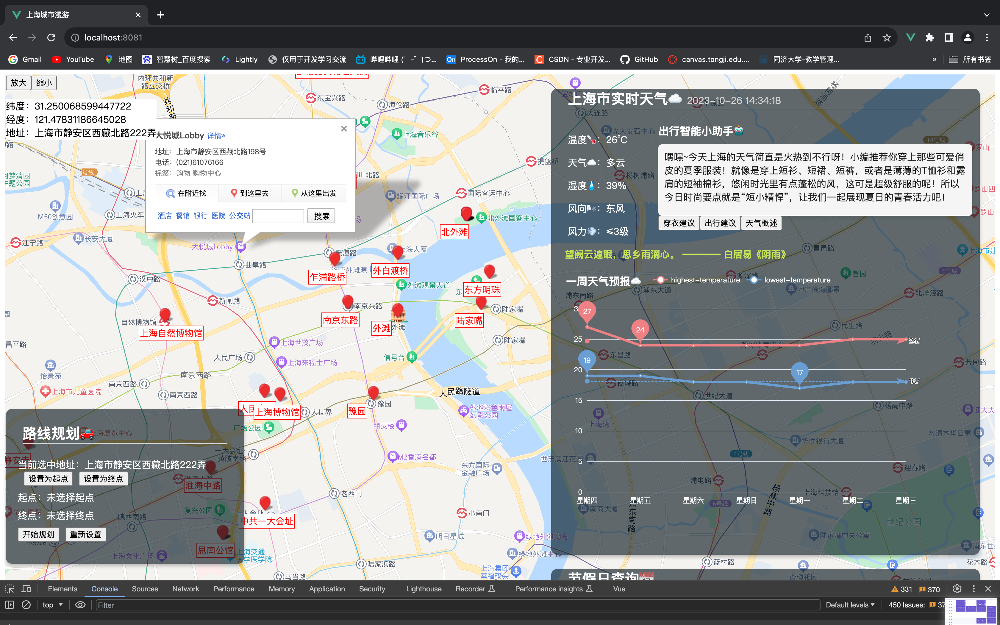
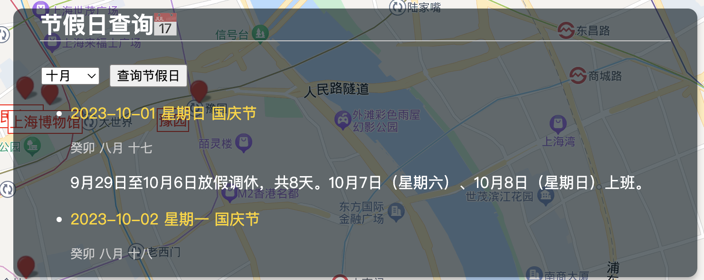
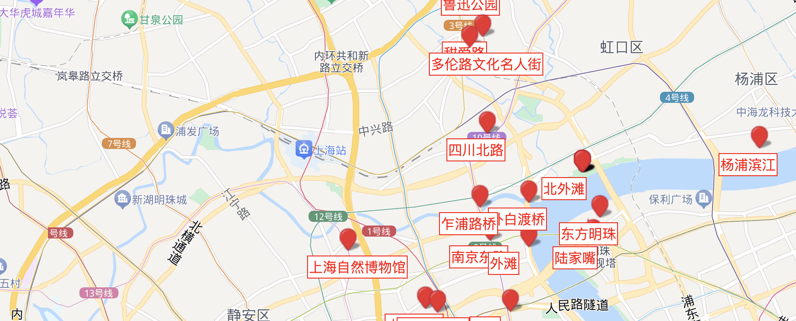
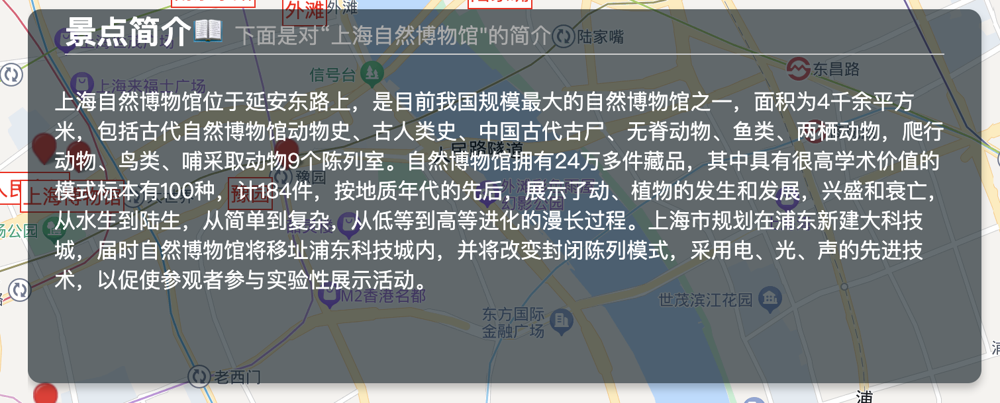
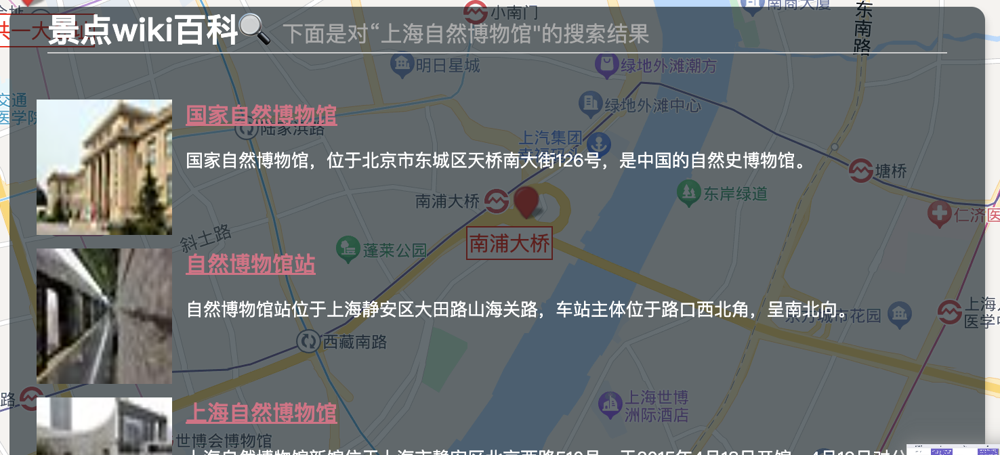
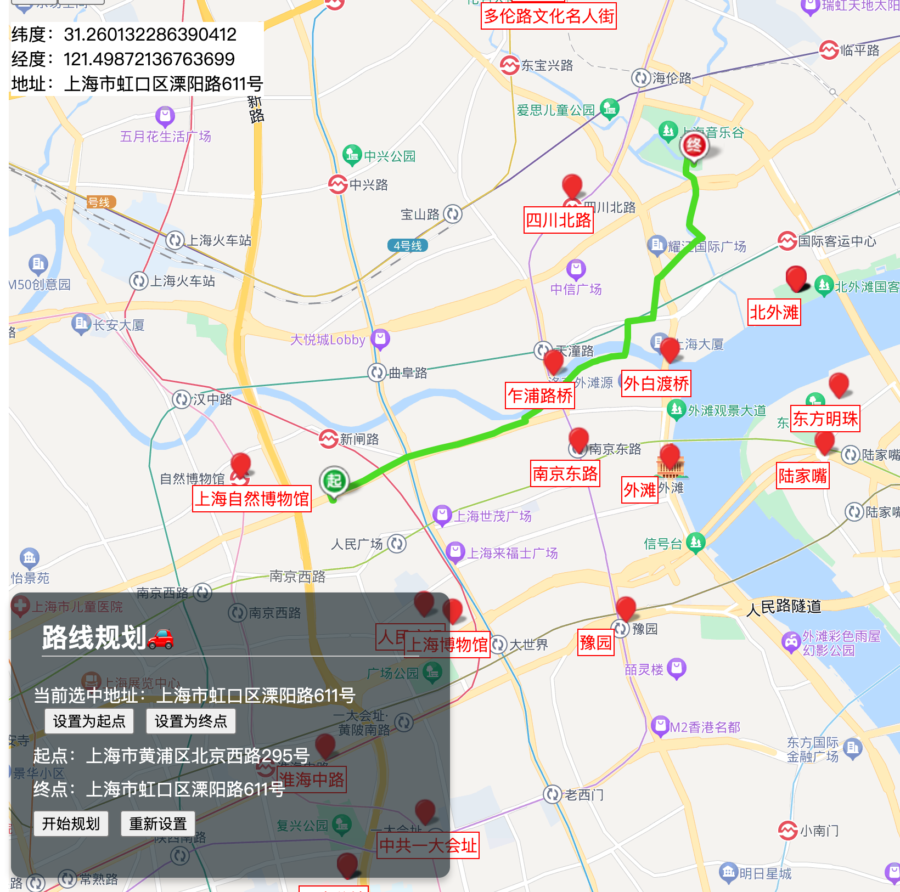
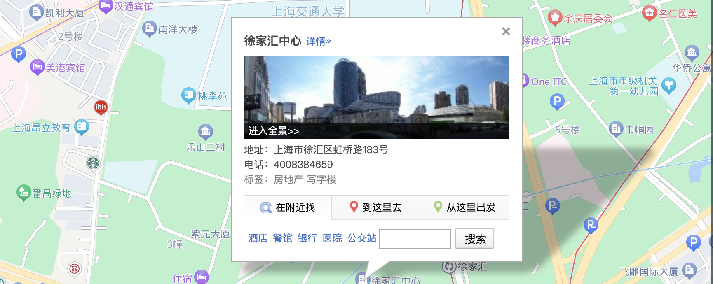

# 上海citywalk指南  

2051498储岱泽

---
## introduction

“上海CityWalk指南”是一个基于Vue3开发的出行地图系统。该项目整合了百度地图API、高德地图天气API、ChatGPT的API、维基百科API以及来自天行数据的天气诗句API、节假日查询API和景点介绍API等多个功能模块，旨在为用户提供一个全方位的地图系统。  

通过“上海CityWalk指南”，用户可以快速获取关于上海市的各种信息，包括天气预报、节假日查询、地理信息、维基百科介绍、景点介绍等。用户可以使用该系统规划路线、导航、查询天气情况，并了解上海市的文化、历史和旅游资源，同时也能够查询节假日，更方便的安排自己的出行日期。  

## Background

上海作为中国最具国际化的城市之一，拥有着丰富的历史文化和现代都市风光。现如今在上海"citywalk"已经成为了一个流行的词汇，该词汇的意思大抵是指：探索城市，在城市的漫步中收获乐趣。  
然而，对于首次来到上海的游客来说，往往难以找到合适的旅游路线和景点，同时也不是很清楚各个景点背后的文化内涵。同时，一次美好的citywalk计划不仅仅需要优秀的路线，也需要一份美好的天气和合适的时机。因此，我们通过"上海citywalk指南"这个项目，为游客提供一份详尽的上海市区步行旅游指南，包括路线规划，天气查询，景点介绍，节假日查询等内容，让游客可以更加轻松地探索这座城市的魅力。

## Goal

- 整合多个在线数据源，包括天气预报、百度地图、景点介绍、维基百科、天气诗句、节假日查询等API，以为城市探索者提供全面的信息。
  
- 提供用户友好的界面，允许用户通过点击景点标注的点来获取景点介绍和百科搜索结果，交互方便有趣。
  
- 实现出行智能小助手功能，使得用户可以根据当天的天气状况获得合理的出行建议，穿衣建议以及天气概述。

- 使用echart展示未来一周的天气，折线图方便用户看到未来天气的走势。

- 提供导航和路线规划的功能，使得使用者不再迷路。

---

## 技术路线  

为了实现我的“上海citywalk指南”项目，我经过仔细考虑并选择了以下技术栈，以满足项目的需求和目标：

### 前端技术  

- **Vue3**：我选择了Vue3作为前端框架，因为它提供了灵活性和性能，允许我构建交互式、响应式的用户界面。Vue3的Composition API使代码组织更加清晰和可维护。

- **Axios**：我使用Axios来进行网络请求，包括从各个在线数据源获取景点信息和天气状况所需的数据。Axios提供了易于使用的方式来处理HTTP请求，并处理响应数据。

- **Eslint**：我选择Eslint作为代码风格统一的管理工具，使得前端代码变得规范。

- **echarts**: 我选择echarts来展示上海一周的天气状况以及走势，清晰明了，可以让用户很清晰的规划未来一周的出行。

## 部署和托管

- **Nginx**：使用Nginx来进行项目的部署。
- **git**: 通过git来实现项目的版本控制和管理。

---

## 实现细节

### 界面总览

  
  

### 前端页面结构

1. 实时天气与一周天气预报

- 展示当前实时天气状况。
- 右侧出行智能小助手可以给出一些出行建议。
- 显示符合当前天气状况应景的诗句，增添应用的趣味性。
- 显示接下来一周的天气预报，将最高气温和最低气温做成折线图。同时，当用户把鼠标悬浮在图表上的时候可以显示当天最高最低气温，以及日出日落时间，同时获得当天的天气状况。

  

2. 节假日查询  

用户可以在下拉框选择对应的月份，查询该月所有的节假日信息，从而合理的安排自己的出行。

 

3. 景点简介  

在地图上用红色的标记标出了所有值得一看的景点，用户可以点击这些红色的标记，然后右边的“景点简介”以及“景点Wiki百科”部分就会显示该景点的介绍以及搜索结果，让用户全方位的了解这个景点。

 
 

4. 景点wiki百科  

 

5. 路径规划  

- 用户单击地图上的点就会在左上角显示当前选中的点的具体的经纬度和地名，此时如果用户在左下角的路线规划板块选择“设置为起点”，就可以将该地点设置为起点，点击“设置为终点”就可以将该地点设置为终点。

- 点击“开始规划”进行路径规划。

- 点击“重新设置”重新对起点和终点进行选择。

 

6. 导航功能

用户可以点击地图上的点唤醒百度地图自带的导航功能。

 

